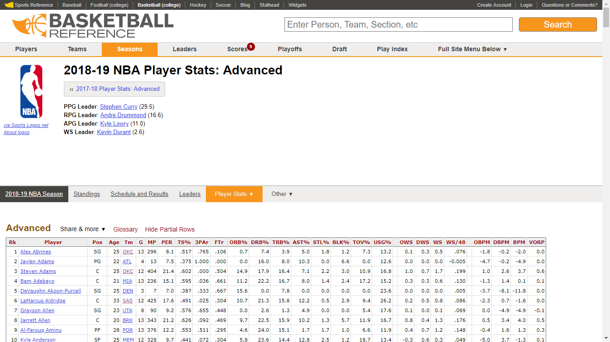
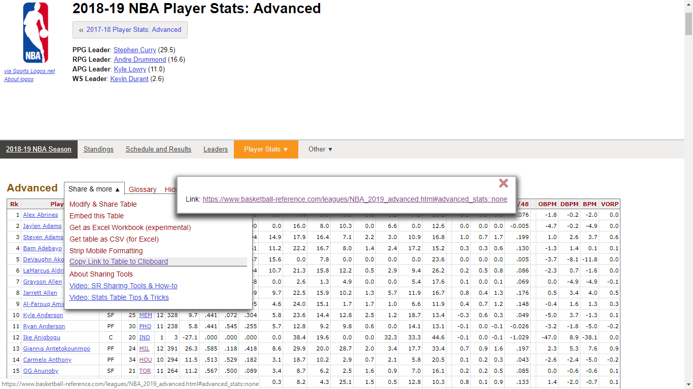

```{r setup, include=FALSE}
knitr::opts_chunk$set(echo = TRUE)
```

# Análisando jogadores para assuntos no podcast e posts no blog.

## Introdução

O principal objtivo é extrair dados dos jogadores da **NBA**. A raspagem no site oficial da NBA é menos intuitiva, por isso vamos utilizar o site <https://www.basketball-reference.com/> *(BR)* usando o pacote `rvest`. O basketball reference facilita bastante o *scrap* dos dados, disponibilizando o *download* de aqruivos .csv e opções de customização das tabelas no próprio site. Vai rolar muito `%>%` e claro, muito `tidyverse`!  
```{r Pacotes, message=FALSE}
library(rvest)
library(png)#Para o logo
library(cowplot)
library(tidyverse)
```
Vamos agora separar o link. Queremos fazer algumas análises de estatísticas avançadas de todos os jogadores. Essas informações são diariamente atualizadas em <https://www.basketball-reference.com/leagues/NBA_2019_advanced.html>. Um pequeno tutorial de como pegar a tabela correta da página.     
Como só existe uma tabela na página, o *scrap* demanda menos atenção.
```{r im_1, echo=FALSE, fig.cap="Print da Página.", out.width = '70%',fig.align='center'}

```
Para selecionar a tabela de interesse, selecionamos a opção de copiar o link direto da tabela: 
```{r im_2, echo=FALSE, fig.cap="Print do direcionamento para a tabela correta.", out.width = '70%',fig.align='center'}

```

## Carregando e tratando dos dados

```{r Carregando e limpando os dados}
link <- read_html("https://www.basketball-reference.com/leagues/NBA_2019_advanced.html#advanced_stats::none") #Lendo o HTML direto da WEB

players_adv <- as.data.frame( # Transformando em um data frame...
  html_table( # ...Uma tabela...
    html_nodes(x = link, css = "table") # ...Que possui o link "x" e o formato css "table"
    )
  )

players_adv <- players_adv %>% # Pegando o dataframe
  filter(!str_detect(Rk, "Rk")) %>% # Retirando as linhas que possuem a repetição do nome das colunas
  select(-c(Var.25,Var.20)) %>% # Retirando as colunas "fantasmas", provinientes da formatação da página
  mutate_at(vars(-Player, -Pos, -Tm), funs(as.numeric)) %>% # Transformando as variaveis que não são fatores ou caracteres em valores numericos
  tbl_df() # Transformando tudo isso em tibble
```

Bom, vamos dar uma olhada no data set.
```{r olhando o banco,include=FALSE}
players_adv %>% head
```
Aparentemente está tudo ok. Vamos tentar fazer algo agora.
 
## Um apanhado quanto as defesas na nba moderna. Afinal o pivo ainda existe na **NBA** moderna?

Um questionamento que venho tendo desde as ultimas três temporadas da **NBA** é a existencia do pivo moderno. Ele realmente é um *Big man*? ou só um ala alto?  
Pensei em começar analusando os números defensivos dessa temporada para ter uma ideia. O pivo original exerce força no ataque e protege o aro na defesa. Assim, vamos ver a fundo como se comparta uma relação do **Total Rebound Percentage** e o **Defensive Box Plus/Minus**.  O *TRP* trata-se de uma estimativa do percentual de rebotes disponiveis enquanto o mesmo estava em quadra. O *DBPM* é uma estimativa de pontos defensivos por 100 posses de bola que um jogador contribui acima da média da liga caso estivesse me um time médio da **NBA**.   
```{r construindo uma viz, fig.align='center'}

defesa <- players_adv %>%
  filter((MP) >= quantile(MP, 0.25)) %>%
  ggplot(aes(x = DRB., y = DBPM, 
             color = factor(Pos,levels = c("PG", "SG", "SF", "PF", "C"))))+
  geom_point()+
  labs(x = "Defensive Rebound Percentage",
       title = "How big is the big man today ?",
       subtitle = "on a defensive spectrum",
       y = "Defensive Box Plus/Minus",
       color = "Position",
       caption = paste0("Dados: Basketball reference\nVisualização: @cestade7\n",
                        "Atualizado: ",format(Sys.Date(), "%d/%m")))+
  scale_color_manual(values = c("PG" = "#F75654", "SG" = "#49B5FF", "SF" = "#FFFE0D",
                                "PF" = "#B2B26B", "C" = "#B20300"))

ggdraw()+
  draw_image("cesta_7_basq.png", scale = 0.20, x=0.42,y=0.41)+
  draw_plot(defesa)

```

Vamos adicionar alguns centroids a partir de k-médias, para achar os centros e ficar mais simples de comparar. `k = 5`
```{r colocando centroids, fig.align='center'}
players_adv %>% 
  filter(MP >= quantile(MP, 0.25)) %>%
  select(DRB.,DBPM) %>% 
  kmeans(centers = 5) -> km

centroids <- data.frame(km$centers)
centroids <- data.frame(centroids, Cluster = factor(c(1:5)))

ggdraw()+
  draw_image("cesta_7_basq.png", scale = 0.20, x=0.42,y=0.41)+
  draw_plot(defesa+
              geom_point(data = centroids, aes(x = DRB., y = DBPM,shape = Cluster), size = 8, color = "#FF3806", stroke = 2,
              alpha = 0.7,inherit.aes = FALSE)+
              labs(x = "Defensive Rebound Percentage",
       subtitle = "Cluster de defensores na NBA por k-médias",
       title = "Vamos classificar a NBA em 5 posições para analisar a defesa",
       color = "Position",
       y = "Defensive Box Plus/Minus",
       caption = paste0("Dados: Basketball reference\nVisualização: @cestade7\n",
                        "Atualizado: ",format(Sys.Date(), "%d/%m")))+
         theme(
           legend.position = "bottom",
           legend.justification = "center",
         ))
```

