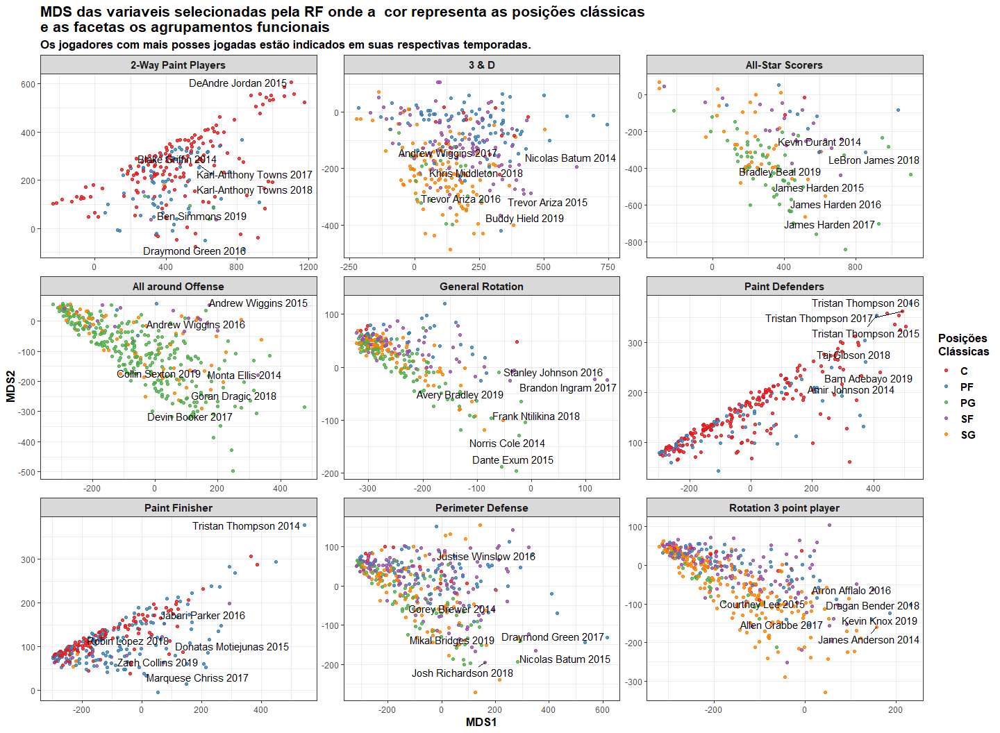
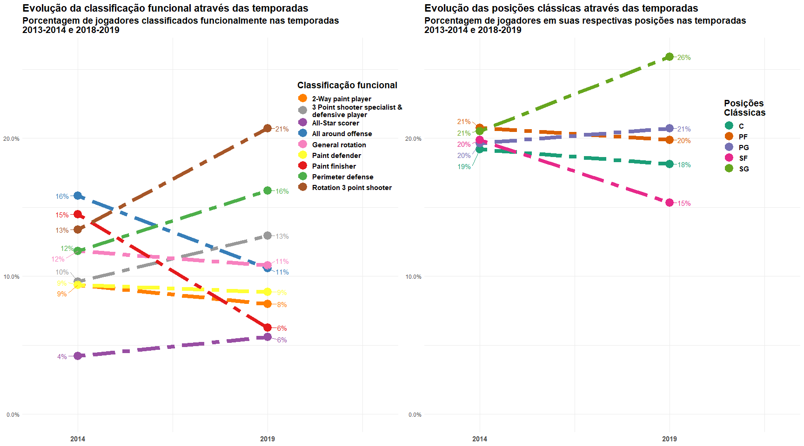

Resultados Led Date
================
Arthur Rios de Azevedo e João Vitor Rocha da Silva
01/11/2019

## Descrição das posições

| Posição | Nome em Português | Descrição                                                                                                                                                                                                                                                                                                                                                                                              |
| :------ | :---------------- | :----------------------------------------------------------------------------------------------------------------------------------------------------------------------------------------------------------------------------------------------------------------------------------------------------------------------------------------------------------------------------------------------------- |
| PG      | Armador           | O armador é o clássico “Técnico dentro de quadra”, de maneira geral sempre foi o melhor jogador dentro de quadra em termos de habilidades de passe e controle de bola. Tem como função liderar a equipe dentro de quadra nas execuções das jogadas propostas pelo técnico, criar oportunidades ofensivas para si e para seus companheiros de time. Normalmente sempre lidera a equipe em assistências. |
| SG      | Ala-armador       | Ala-armador (SG), de forma geral os ala-armadores são conhecidos por suas habilidades ofensivas e defensivas. Normalmente são os melhores defensores dentro de quadra e muitas vezes os melhores atacantes, com grande aproveitamento da linha de 3 pontos. Tem a capacidade de se mover sem a bola criando oportunidades de receber a bola do armador e finalizar a jogada.                           |
| SF      | Ala               | Ala (SF), os alas são os jogadores que tem mais habilidades variadas dentro de quadra, existem diversos tipos com diversas habilidades diferentes, bons arremessadores, bons infiltradores, bons passadores ou até bons “cavadores de falta”, os alas normalmente sabem de tudo um pouco. Suas funções normalmente estão voltadas para o lado ofensivo.                                                |
| PF      | Ala-pivô          | Ala-pivô (PF), são os atletas que tem maior versatilidade dentro da linha de 3 pontos, seja atacando o garrafão ou arremessando de meia distância. Em termos defensivos são normalmente jogadores fortes e ágeis para marcar outros jogadores que infiltrem de forma mais rápida.                                                                                                                      |
| C       | Pivô              | Pivô (C), normalmente é o jogador que fica perto da cesta tanto no lado ofensivo quanto no lado defensivo. É normalmente o jogador mais alto dentro de quadra, e no time sempre lidera em rebotes. São os jogadores mais pesados e mais fortes dentro de quadra sempre dominando o garrafão ofensivamente e defensivamente.                                                                            |

Fonte: <https://pt.wikipedia.org/wiki/Basquetebol>

## Imagem 1

<!-- -->

## Imagem 2

<!-- -->
